# Coze Loop Database Entity Relationship Diagram

This ER diagram shows the database schema for Coze Loop, illustrating the relationships between users, spaces, prompts, datasets, evaluators, and experiments.

```mermaid
erDiagram
    %% Core User and Space Management
    user {
        bigint id PK
        varchar name
        varchar unique_name UK
        varchar email UK
        varchar password
        varchar description
        varchar icon_uri
        tinyint user_verified
        bigint country_code
        varchar session_key
        bigint deleted_at
        datetime created_at
        datetime updated_at
    }

    space {
        bigint id PK
        bigint owner_id FK
        varchar name
        varchar description
        tinyint space_type "1:Personal, 2:Team"
        varchar icon_uri
        bigint created_by FK
        bigint deleted_at
        datetime created_at
        datetime updated_at
    }

    space_user {
        bigint id PK
        bigint space_id FK
        bigint user_id FK
        int role_type "1:owner, 2:admin, 3:member"
        bigint deleted_at
        datetime created_at
        datetime updated_at
    }

    api_key {
        bigint id PK
        varchar key
        varchar name
        tinyint status
        bigint user_id FK
        bigint expired_at
        datetime created_at
        datetime updated_at
        bigint deleted_at
        bigint last_used_at
    }

    %% Prompt Management
    prompt_basic {
        bigint id PK
        bigint space_id FK
        varchar prompt_key UK
        varchar name
        varchar description
        varchar created_by
        varchar updated_by
        varchar latest_version
        datetime latest_commit_time
        datetime created_at
        datetime updated_at
        bigint deleted_at
    }

    prompt_commit {
        bigint id PK
        bigint space_id FK
        bigint prompt_id FK
        varchar prompt_key
        varchar template_type
        longtext messages
        text model_config
        text variable_defs
        longtext tools
        text tool_call_config
        varchar version UK
        varchar base_version
        varchar committed_by
        text description
        datetime created_at
        datetime updated_at
    }

    prompt_user_draft {
        bigint id PK
        bigint space_id FK
        bigint prompt_id FK
        varchar user_id
        varchar template_type
        longtext messages
        text model_config
        text variable_defs
        longtext tools
        text tool_call_config
        varchar base_version
        tinyint is_draft_edited
        datetime created_at
        datetime updated_at
        bigint deleted_at
    }

    prompt_debug_context {
        bigint id PK
        bigint prompt_id FK
        varchar user_id
        longtext mock_contexts
        longtext mock_variables
        longtext mock_tools
        text debug_config
        longtext compare_config
        datetime created_at
        datetime updated_at
        bigint deleted_at
    }

    %% Dataset Management
    dataset {
        bigint id PK
        int app_id
        bigint space_id FK
        bigint schema_id
        varchar name
        varchar description
        varchar category
        varchar biz_category
        varchar status
        varchar security_level
        varchar visibility
        json spec
        json features
        varchar latest_version
        bigint next_version_num
        varchar last_operation
        varchar created_by
        datetime created_at
        varchar updated_by
        datetime updated_at
        bigint deleted_at
        timestamp expired_at
    }

    dataset_schema {
        bigint id PK
        bigint space_id FK
        varchar name
        varchar description
        json schema_definition
        varchar created_by
        datetime created_at
        varchar updated_by
        datetime updated_at
        bigint deleted_at
    }

    dataset_version {
        bigint id PK
        bigint dataset_id FK
        bigint space_id FK
        varchar version
        varchar description
        varchar status
        json snapshot_info
        bigint item_count
        varchar created_by
        datetime created_at
        varchar updated_by
        datetime updated_at
        bigint deleted_at
    }

    dataset_item {
        bigint id PK
        bigint dataset_id FK
        bigint space_id FK
        varchar item_key
        json item_data
        varchar status
        varchar created_by
        datetime created_at
        varchar updated_by
        datetime updated_at
        bigint deleted_at
    }

    dataset_item_snapshot {
        bigint id PK
        bigint dataset_version_id FK
        bigint dataset_item_id FK
        bigint space_id FK
        varchar item_key
        json item_data
        datetime created_at
    }

    dataset_io_job {
        bigint id PK
        bigint dataset_id FK
        bigint space_id FK
        varchar job_type
        varchar status
        json config
        json result
        varchar created_by
        datetime created_at
        datetime updated_at
    }

    %% Evaluation System
    evaluator {
        bigint id PK
        bigint space_id FK
        int evaluator_type
        varchar name
        varchar description
        tinyint draft_submitted
        varchar created_by
        varchar updated_by
        datetime created_at
        datetime updated_at
        timestamp deleted_at
        varchar latest_version
    }

    evaluator_version {
        bigint id PK
        bigint evaluator_id FK
        bigint space_id FK
        varchar version
        json evaluator_config
        varchar description
        varchar created_by
        datetime created_at
        datetime updated_at
        timestamp deleted_at
    }

    evaluator_record {
        bigint id PK
        bigint evaluator_id FK
        bigint space_id FK
        varchar request_id
        json input_data
        json output_data
        varchar status
        text error_message
        datetime created_at
        datetime updated_at
    }

    eval_target {
        bigint id PK
        bigint space_id FK
        varchar source_target_id
        int target_type
        varchar created_by
        varchar updated_by
        datetime created_at
        datetime updated_at
        timestamp deleted_at
    }

    eval_target_version {
        bigint id PK
        bigint eval_target_id FK
        bigint space_id FK
        varchar version
        json target_config
        varchar description
        varchar created_by
        datetime created_at
        datetime updated_at
        timestamp deleted_at
    }

    eval_target_record {
        bigint id PK
        bigint eval_target_id FK
        bigint space_id FK
        varchar request_id
        json input_data
        json output_data
        varchar status
        text error_message
        datetime created_at
        datetime updated_at
    }

    %% Experiment System
    experiment {
        bigint id PK
        bigint space_id FK
        varchar created_by
        varchar name
        varchar description
        bigint eval_set_version_id FK
        bigint target_type
        bigint target_version_id
        blob eval_conf
        int status
        blob status_message
        timestamp start_at
        timestamp end_at
        datetime created_at
        datetime updated_at
        timestamp deleted_at
        bigint latest_run_id
        bigint target_id
        bigint eval_set_id
        int credit_cost
        int source_type
        varchar source_id
        int expt_type
        bigint max_alive_time
    }

    expt_run_log {
        bigint id PK
        bigint experiment_id FK
        bigint space_id FK
        varchar run_id
        varchar status
        json run_config
        json run_result
        timestamp start_at
        timestamp end_at
        datetime created_at
        datetime updated_at
    }

    expt_item_result {
        bigint id PK
        bigint experiment_id FK
        bigint space_id FK
        varchar run_id
        bigint item_id
        json input_data
        json output_data
        json evaluation_result
        varchar status
        datetime created_at
        datetime updated_at
    }

    expt_turn_result {
        bigint id PK
        bigint experiment_id FK
        bigint space_id FK
        varchar run_id
        bigint item_id
        int turn_index
        json turn_data
        json turn_result
        datetime created_at
        datetime updated_at
    }

    expt_aggr_result {
        bigint id PK
        bigint experiment_id FK
        bigint space_id FK
        varchar run_id
        varchar metric_name
        decimal metric_value
        json metric_details
        datetime created_at
        datetime updated_at
    }

    expt_stats {
        bigint id PK
        bigint experiment_id FK
        bigint space_id FK
        varchar run_id
        json statistics
        datetime created_at
        datetime updated_at
    }

    %% Model Request Tracking
    model_request_record {
        bigint id PK
        bigint space_id FK
        varchar user_id
        varchar usage_scene
        varchar usage_scene_entity_id
        varchar frame
        varchar protocol
        varchar model_identification
        varchar model_ak
        varchar model_id
        varchar model_name
        bigint input_token
        bigint output_token
        varchar logid
        varchar error_code
        text error_msg
        datetime created_at
        datetime updated_at
    }

    %% Relationships
    user ||--o{ space : "owns"
    user ||--o{ space_user : "member_of"
    user ||--o{ api_key : "has"
    
    space ||--o{ space_user : "has_members"
    space ||--o{ prompt_basic : "contains"
    space ||--o{ dataset : "contains"
    space ||--o{ evaluator : "contains"
    space ||--o{ experiment : "contains"
    space ||--o{ model_request_record : "tracks"
    
    prompt_basic ||--o{ prompt_commit : "has_versions"
    prompt_basic ||--o{ prompt_user_draft : "has_drafts"
    prompt_basic ||--o{ prompt_debug_context : "has_debug_sessions"
    
    dataset ||--o{ dataset_version : "has_versions"
    dataset ||--o{ dataset_item : "contains_items"
    dataset ||--o{ dataset_io_job : "has_jobs"
    dataset }o--|| dataset_schema : "uses_schema"
    
    dataset_version ||--o{ dataset_item_snapshot : "contains_snapshots"
    dataset_item ||--o{ dataset_item_snapshot : "has_snapshots"
    
    evaluator ||--o{ evaluator_version : "has_versions"
    evaluator ||--o{ evaluator_record : "has_records"
    
    eval_target ||--o{ eval_target_version : "has_versions"
    eval_target ||--o{ eval_target_record : "has_records"
    
    experiment ||--o{ expt_run_log : "has_runs"
    experiment ||--o{ expt_item_result : "has_item_results"
    experiment ||--o{ expt_turn_result : "has_turn_results"
    experiment ||--o{ expt_aggr_result : "has_aggregated_results"
    experiment ||--o{ expt_stats : "has_statistics"
    
    dataset_version ||--o{ experiment : "used_in_experiments"
```

## Key Entities and Relationships

### Core System
- **Users** can own and be members of multiple **Spaces**
- **Spaces** contain all other entities (prompts, datasets, evaluators, experiments)
- **API Keys** are owned by users for authentication

### Prompt Management
- **Prompt Basic** stores prompt metadata
- **Prompt Commit** stores versioned prompt configurations
- **Prompt User Draft** stores user draft versions
- **Prompt Debug Context** stores debugging session data

### Dataset Management
- **Datasets** contain structured data items
- **Dataset Schema** defines the structure of dataset items
- **Dataset Versions** create snapshots of datasets
- **Dataset Items** are the actual data entries
- **Dataset Item Snapshots** preserve item state in versions

### Evaluation System
- **Evaluators** define evaluation logic and criteria
- **Eval Targets** represent objects to be evaluated (like prompts)
- Both have versioning and execution records

### Experiment System
- **Experiments** combine datasets, targets, and evaluators
- **Experiment Runs** track execution instances
- **Results** are stored at item, turn, and aggregated levels
- **Statistics** provide experiment summaries

### Monitoring
- **Model Request Records** track all LLM API calls with usage metrics